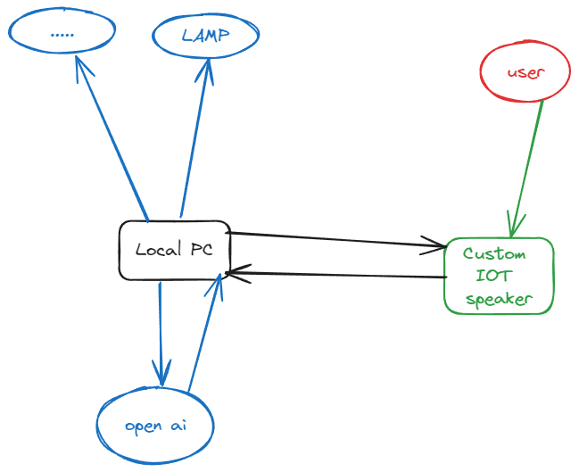

# GAMA POC3 XIAOAI GPT

## 架构图

### 小米音箱

### 未来状态

### 搭建项目

- 下载 repo
- 创建一个 `.env` 文件
- 加入微信群环境环境变量
- npm install
- npm run dev

### OPENAI Tools
https://platform.openai.com/docs/guides/function-calling

## Doc
https://home.miot-spec.com/
https://github.com/idootop/mi-gpt
https://home.miot-spec.com/spec?type=urn:miot-spec-v2:device:speaker:0000A015:xiaomi-lx06:2